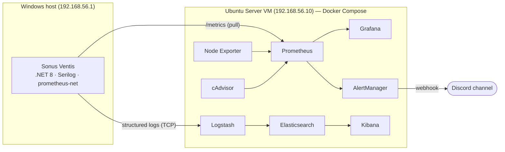
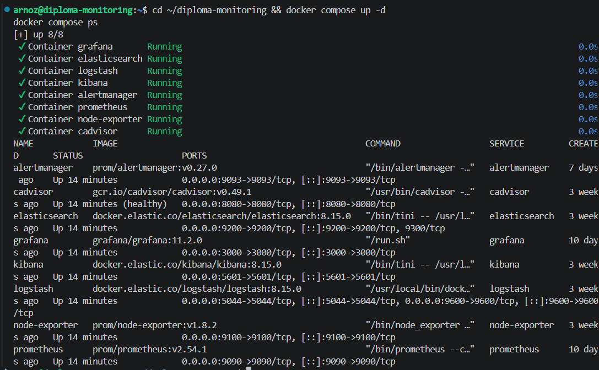
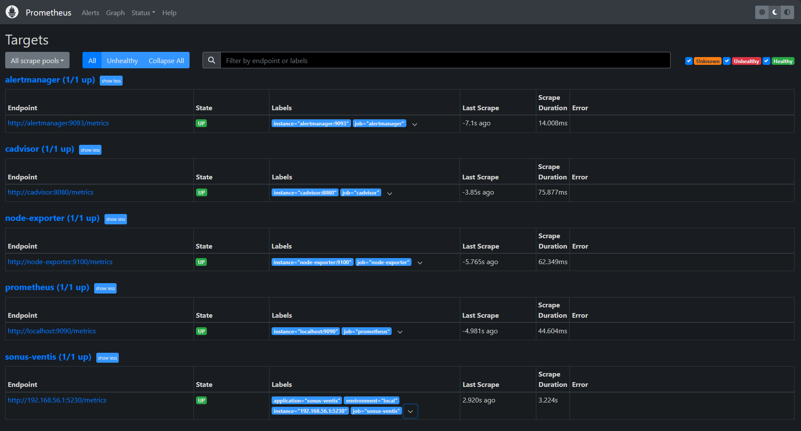
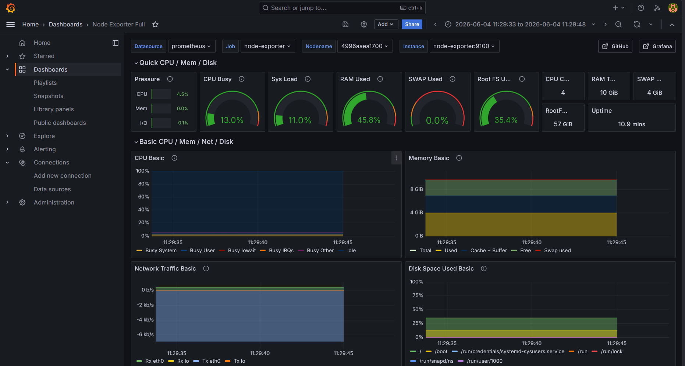
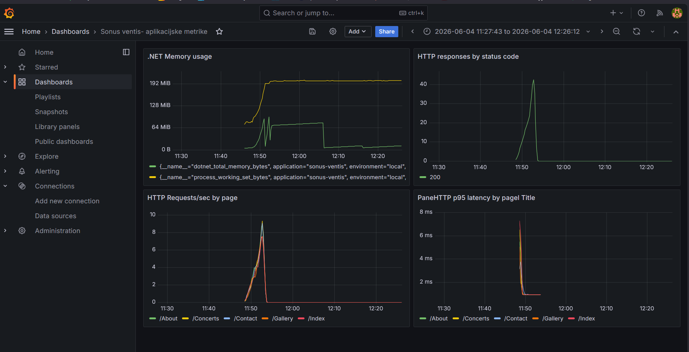
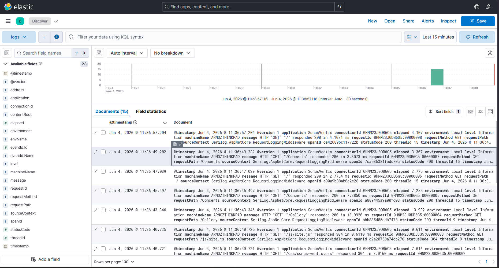
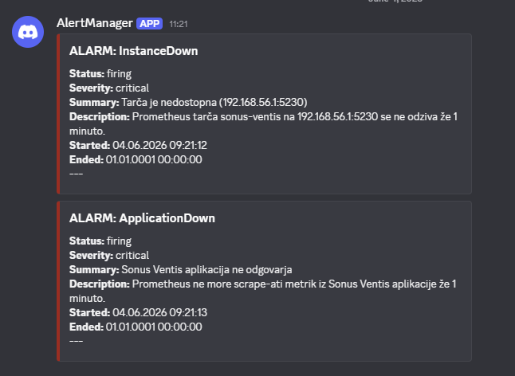
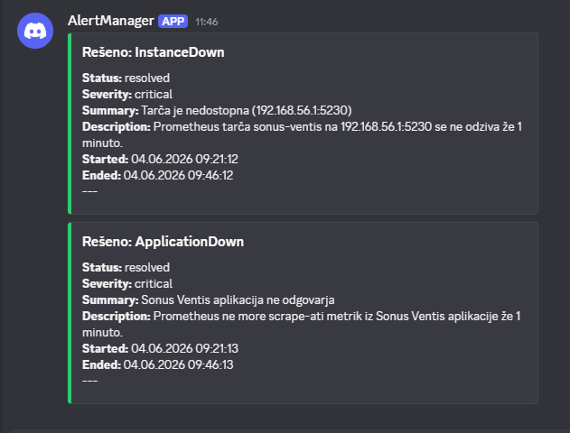

# 📊 Diploma Monitoring — Centralized Monitoring & Log Aggregation for a .NET Web Application

A production-style observability stack (metrics, centralized logging, alerting and load testing) built around a real ASP.NET Core 8 web application (**Sonus Ventis**), running in Docker on an Ubuntu Server VM. Created as the practical part of a diploma thesis at UM FERI.

[📖 About](#-about) • [🏗️ Architecture](#️-architecture) • [🧰 Tech Stack](#-tech-stack) • [⚙️ Setup](#️-setup) • [📈 Screenshots](#-screenshots) • [🧪 Load Testing & Analysis](#-load-testing--analysis) • [📂 Repository Structure](#-repository-structure)

---

## 📖 About

This repository contains the full, reproducible monitoring infrastructure developed for the diploma thesis *"Vzpostavitev in optimizacija sistema za monitoring in centralizirano beleženje logov v Linux okolju"*.

A real .NET web application (**Sonus Ventis**) is used as the live source of metrics and logs. Around it, the stack provides:

- **Metrics monitoring** — system and application metrics collected by Prometheus, visualized in Grafana.
- **Centralized logging** — structured application logs shipped through Logstash into Elasticsearch, searchable in Kibana.
- **Real-time alerting** — AlertManager rules that notify a Discord channel when thresholds are breached.
- **Load testing & impact analysis** — k6 scenarios used to stress the application and measure the resource overhead of the monitoring stack itself.

Everything runs as containers via Docker Compose on an **Ubuntu Server 22.04 LTS** virtual machine.

---

## 🏗️ Architecture



The application exposes a `/metrics` endpoint scraped by Prometheus and streams structured logs over TCP to Logstash. System metrics come from Node Exporter (host) and cAdvisor (containers).

---

## 🧰 Tech Stack

| Component | Role | Version | Port |
|---|---|---|---|
| Prometheus | Metrics collection & alert evaluation | v2.54.1 | 9090 |
| Node Exporter | Host system metrics | v1.8.2 | 9100 |
| cAdvisor | Container metrics | v0.49.1 | 8080 |
| Grafana | Metrics dashboards | v11.2.0 | 3000 |
| AlertManager | Alert routing & Discord notifications | v0.27.0 | 9093 |
| Elasticsearch | Log storage & indexing | 8.15.0 | 9200 |
| Logstash | Log ingestion pipeline | 8.15.0 | 5044 / 9600 |
| Kibana | Log search & exploration | 8.15.0 | 5601 |
| k6 | Load testing | latest | — |

**Application:** ASP.NET Core 8 (Razor Pages) · [Serilog](https://serilog.net/) (Console + TCP sink to Logstash) · [`prometheus-net.AspNetCore`](https://github.com/prometheus-net/prometheus-net) exposing `/metrics`.

---

## ⚙️ Setup

> **Prerequisites:** Docker & Docker Compose on an Ubuntu Server VM. The Sonus Ventis application runs on the host and must be reachable from the VM on `192.168.56.1:5230`.

**1. Clone the repository**

```bash
git clone https://github.com/Arnoz-Siljan/diploma-monitoring.git
cd diploma-monitoring
```

**2. Create the AlertManager config from the template**

The real `alertmanager.yml` is gitignored because it contains a Discord webhook URL. Copy the committed template and fill in your own webhook:

```bash
cp alertmanager/alertmanager.yml.template alertmanager/alertmanager.yml
# then edit alertmanager/alertmanager.yml and insert your Discord webhook URL
```

**3. Start the stack**

```bash
docker compose up -d
docker compose ps
```

**4. Access the services** (from the host, replacing the IP with your VM's address)

| Service | URL |
|---|---|
| Grafana | http://192.168.56.10:3000 |
| Prometheus | http://192.168.56.10:9090 |
| Kibana | http://192.168.56.10:5601 |
| AlertManager | http://192.168.56.10:9093 |

Grafana dashboards used: **Node Exporter Full** (ID 1860), **cAdvisor** (ID 19792), and a custom *Sonus Ventis – aplikacijske metrike* dashboard.

---

## 📈 Screenshots

### 🟢 Stack running

All eight containers up via Docker Compose.



### 🎯 Prometheus targets

Every exporter and the application healthy (`UP`).



### 🖥️ System metrics (Grafana — Node Exporter Full)

Host CPU, memory, disk and network.



### 📊 Application metrics (Grafana — custom dashboard)

Requests/sec per page, p95 latency, HTTP status codes and .NET memory usage.



### 📜 Centralized logs (Kibana — Discover)

Structured Serilog logs from Sonus Ventis, indexed in Elasticsearch.



### 🚨 Alerting (AlertManager → Discord)

End-to-end alerting: firing notification, then automatic resolution.

| Firing | Resolved |
|---|---|
|  |  |

---

## 🧪 Load Testing & Analysis

A staged **k6** scenario (smoke → ramp-up → sustained → stress → cool-down) drives traffic against the application while the stack records the impact.

- Scenario: [`loadtest/sonus-ventis-loadtest.js`](loadtest/sonus-ventis-loadtest.js)
- Raw k6 output: [`analiza/k6_output.txt`](analiza/k6_output.txt)
- Resource impact analysis (idle vs. load): [`analiza/analiza.py`](analiza/analiza.py) → [`analiza/rezultati_analiza.txt`](analiza/rezultati_analiza.txt)

The analysis compares CPU/RAM consumption of the monitoring stack at idle versus under load to quantify the overhead introduced by monitoring and logging.

---

## 📂 Repository Structure

```text
diploma-monitoring/
├── docker-compose.yml              # Full stack definition
├── prometheus/
│   ├── prometheus.yml              # Scrape config
│   └── alert_rules.yml             # Alert rules (system + application)
├── alertmanager/
│   ├── alertmanager.yml.template   # Template (real config is gitignored)
│   └── templates/
│       └── discord.tmpl            # Discord notification template
├── logstash/
│   ├── config/logstash.yml
│   └── pipeline/logstash.conf      # Log ingestion pipeline
├── loadtest/
│   └── sonus-ventis-loadtest.js    # k6 load test scenario
├── analiza/
│   ├── analiza.py                  # Resource impact analysis script
│   ├── idle_raw.csv / idle_clean.csv
│   ├── load_raw.csv
│   ├── k6_output.txt
│   └── rezultati_analiza.txt       # Analysis results
└── docs/
    └── screenshots/                # Screenshots used in this README
```

---

## ⚠️ Disclaimer

This project was developed for academic purposes as part of a diploma thesis and is provided *as-is*, without warranty of any kind.
