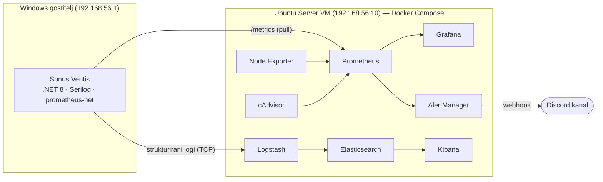

# 📊 Diploma Monitoring — Centralizirani monitoring in beleženje logov za .NET spletno aplikacijo

**🌐 Language / Jezik:** [English](README.md) · **Slovenščina**

Produkcijsko zasnovan sklad za opazljivost (metrike, centralizirano beleženje logov, alarmiranje in obremenitveno testiranje), zgrajen okoli realne ASP.NET Core 8 spletne aplikacije (**Sonus Ventis**), ki teče v Dockerju na Ubuntu Server VM. Izdelano kot praktični del diplomskega dela na UM FERI.

[📖 O projektu](#-o-projektu) • [🏗️ Arhitektura](#️-arhitektura) • [🧰 Tehnološki sklad](#-tehnološki-sklad) • [⚙️ Namestitev](#️-namestitev) • [📈 Posnetki zaslona](#-posnetki-zaslona) • [🧪 Obremenitveno testiranje in analiza](#-obremenitveno-testiranje-in-analiza) • [📂 Struktura repozitorija](#-struktura-repozitorija)

---

## 📖 O projektu

Repozitorij vsebuje celotno, ponovljivo infrastrukturo za monitoring, razvito za diplomsko delo *"Vzpostavitev in optimizacija sistema za monitoring in centralizirano beleženje logov v Linux okolju"*.

Realna .NET spletna aplikacija (**Sonus Ventis**) služi kot živ vir metrik in logov. Okoli nje sklad zagotavlja:

- **Monitoring metrik** — sistemske in aplikacijske metrike zbira Prometheus, vizualizira pa Grafana.
- **Centralizirano beleženje** — strukturirani aplikacijski logi se preko Logstasha indeksirajo v Elasticsearch in so iskljivi v Kibani.
- **Alarmiranje v realnem času** — pravila v AlertManagerju ob preseženih mejah pošljejo obvestilo na Discord kanal.
- **Obremenitveno testiranje in analiza vpliva** — scenariji k6 obremenijo aplikacijo in izmerijo, koliko virov porabi sam sklad za monitoring.

Vse teče kot kontejnerji preko Docker Compose na virtualnem stroju **Ubuntu Server 22.04 LTS**.

---

## 🏗️ Arhitektura



Aplikacija izpostavlja končno točko `/metrics`, ki jo zajema Prometheus, ter pošilja strukturirane loge preko TCP v Logstash. Sistemske metrike prihajajo iz Node Exporterja (gostitelj) in cAdvisorja (kontejnerji).

---

## 🧰 Tehnološki sklad

| Komponenta | Vloga | Verzija | Vrata |
|---|---|---|---|
| Prometheus | Zbiranje metrik in vrednotenje alarmov | v2.54.1 | 9090 |
| Node Exporter | Sistemske metrike gostitelja | v1.8.2 | 9100 |
| cAdvisor | Metrike kontejnerjev | v0.49.1 | 8080 |
| Grafana | Nadzorne plošče za metrike | v11.2.0 | 3000 |
| AlertManager | Usmerjanje alarmov in obvestila na Discord | v0.27.0 | 9093 |
| Elasticsearch | Shramba in indeksiranje logov | 8.15.0 | 9200 |
| Logstash | Cevovod za zajem logov | 8.15.0 | 5044 / 9600 |
| Kibana | Iskanje in pregled logov | 8.15.0 | 5601 |
| k6 | Obremenitveno testiranje | latest | — |

**Aplikacija:** ASP.NET Core 8 (Razor Pages) · [Serilog](https://serilog.net/) (Console + TCP sink v Logstash) · [`prometheus-net.AspNetCore`](https://github.com/prometheus-net/prometheus-net), ki izpostavlja `/metrics`.

---

## ⚙️ Namestitev

> **Predpogoji:** Docker in Docker Compose na Ubuntu Server VM. Aplikacija Sonus Ventis teče na gostitelju in mora biti dosegljiva iz VM-ja na `192.168.56.1:5230`.

**1. Kloniraj repozitorij**

```bash
git clone https://github.com/Arnoz-Siljan/diploma-monitoring.git
cd diploma-monitoring
```

**2. Ustvari AlertManager konfiguracijo iz predloge**

Prava `alertmanager.yml` je gitignored, ker vsebuje Discord webhook URL. Kopiraj commit-ano predlogo in vstavi svoj webhook:

```bash
cp alertmanager/alertmanager.yml.template alertmanager/alertmanager.yml
# nato uredi alertmanager/alertmanager.yml in vstavi svoj Discord webhook URL
```

**3. Zaženi sklad**

```bash
docker compose up -d
docker compose ps
```

**4. Dostop do storitev** (z gostitelja; IP zamenjaj z naslovom svojega VM-ja)

| Storitev | URL |
|---|---|
| Grafana | http://192.168.56.10:3000 |
| Prometheus | http://192.168.56.10:9090 |
| Kibana | http://192.168.56.10:5601 |
| AlertManager | http://192.168.56.10:9093 |

Uporabljene Grafana nadzorne plošče: **Node Exporter Full** (ID 1860), **cAdvisor** (ID 19792) in lastna plošča *Sonus Ventis – aplikacijske metrike*.

---

## 📈 Posnetki zaslona

### 🟢 Delujoč sklad

Vseh osem kontejnerjev teče preko Docker Compose.


### 🎯 Prometheus tarče

Vsi exporterji in aplikacija zdravi (`UP`).


### 🖥️ Sistemske metrike (Grafana — Node Exporter Full)

CPU, pomnilnik, disk in omrežje gostitelja.


### 📊 Aplikacijske metrike (Grafana — lastna plošča)

Zahteve na sekundo po straneh, p95 latenca, HTTP statusne kode in poraba .NET pomnilnika.


### 📜 Centralizirani logi (Kibana — Discover)

Strukturirani Serilog logi iz Sonus Ventis, indeksirani v Elasticsearch.


### 🚨 Alarmiranje (AlertManager → Discord)

Alarmiranje od začetka do konca: obvestilo o proženju in nato samodejna razrešitev.

| Proženje (firing) | Razrešeno (resolved) |
|---|---|
|  |  |

---

## 🧪 Obremenitveno testiranje in analiza

Večfazni **k6** scenarij (smoke → ramp-up → vzdrževana obremenitev → stress → cool-down) pošilja promet na aplikacijo, medtem ko sklad beleži vpliv.

- Scenarij: [`loadtest/sonus-ventis-loadtest.js`](loadtest/sonus-ventis-loadtest.js)
- Surov k6 izpis: [`analiza/k6_output.txt`](analiza/k6_output.txt)
- Analiza vpliva na vire (mirovanje vs. obremenitev): [`analiza/analiza.py`](analiza/analiza.py) → [`analiza/rezultati_analiza.txt`](analiza/rezultati_analiza.txt)

Analiza primerja porabo CPU/RAM sklada za monitoring v mirovanju in pod obremenitvijo ter tako ovrednoti, koliko dodatne porabe vneseta monitoring in beleženje.

---

## 📂 Struktura repozitorija

```text
diploma-monitoring/
├── docker-compose.yml              # Definicija celotnega sklada
├── prometheus/
│   ├── prometheus.yml              # Scrape konfiguracija
│   └── alert_rules.yml             # Pravila za alarme (sistemska + aplikacijska)
├── alertmanager/
│   ├── alertmanager.yml.template   # Predloga (prava konfiguracija je gitignored)
│   └── templates/
│       └── discord.tmpl            # Predloga za Discord obvestila
├── logstash/
│   ├── config/logstash.yml
│   └── pipeline/logstash.conf      # Cevovod za zajem logov
├── loadtest/
│   └── sonus-ventis-loadtest.js    # k6 scenarij obremenitvenega testa
├── analiza/
│   ├── analiza.py                  # Skripta za analizo vpliva na vire
│   ├── idle_raw.csv / idle_clean.csv
│   ├── load_raw.csv
│   ├── k6_output.txt
│   └── rezultati_analiza.txt       # Rezultati analize
└── docs/
    └── screenshots/                # Posnetki zaslona, uporabljeni v tem README-ju
```

---

## ⚠️ Izjava o omejitvi odgovornosti

Projekt je bil razvit v akademske namene kot del diplomskega dela in je na voljo *takšen, kot je*, brez kakršnegakoli jamstva.
